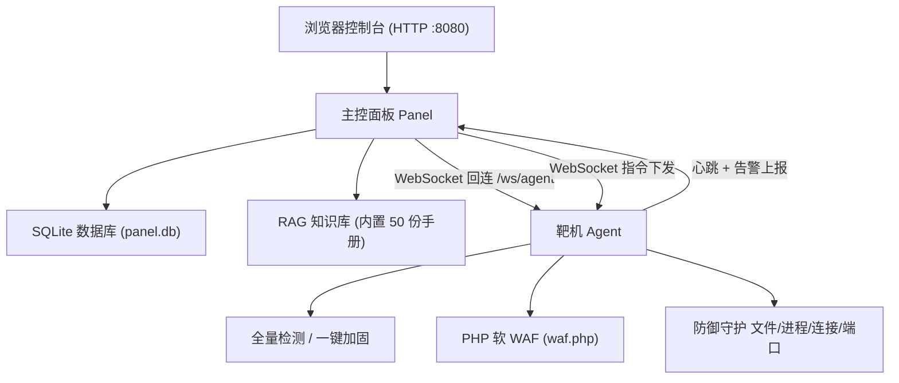

# 综合防御平台 (Shield Platform)

一个开箱即用的**主机综合防御与应急响应平台**，专为网络防御竞赛（AWD/能源综合防御赛）与日常主机安全防护设计。

平台由 **主控面板 + 靶机 Agent + PHP 软 WAF + RAG 知识库** 四部分组成，使用 Go 编写，**单二进制、零外部数据库依赖**，支持 **Linux / Windows 全架构**，中文界面。部署到靶机的 Agent 支持自动回连、全量检测、一键加固、WAF 部署、持续防御守护与远程指令。

> 本项目仅用于合法授权的安全防护、应急处置与教学场景。

---

## 目录

- [核心功能](#核心功能)
- [系统架构](#系统架构)
- [目录结构](#目录结构)
- [环境依赖](#环境依赖)
- [快速开始](#快速开始)
- [功能使用说明](#功能使用说明)
- [跨平台交叉编译](#跨平台交叉编译)
- [数据与配置](#数据与配置)
- [常见问题 FAQ](#常见问题-faq)
- [安全声明](#安全声明)

---

## 核心功能

| 模块 | 说明 |
|------|------|
| 主控面板 | 可视化 Web 控制台，统一管理所有靶机，默认端口 `:8080` |
| 靶机管理 | Agent 自动回连上线，心跳监控在线状态，支持 Linux / Windows |
| 实时监测 | 一键下发全量检测：系统信息、进程异常、监听端口、网络后门、账号安全、登录审计、持久化后门、WebShell、SUID、SSH 配置、防火墙、敏感文件权限、密码策略、异常临时文件等 14+ 项 |
| 一键加固 | 25 项主机加固：SSH 加固、高危账号处置、防火墙启用、后门清理、Web 目录加固、危险 PHP 函数禁用、Redis/MySQL 加固、日志滚动、SELinux/AppArmor 等 |
| PHP 软 WAF | 部署到靶机 Web 目录的轻量 WAF（`waf.php` + `.user.ini`），内置 81 条规则自动拦截 |
| WAF 规则库 | 81 条规则：SQL 注入、命令执行、WebShell、XSS、SSRF、文件包含、上传防护、中间件漏洞、协议攻击、工控安全、扫描器等 |
| 告警中心 | 所有检测告警按严重级别分级，支持「展开」查看完整详情与原始数据 |
| 防御作战 | 持续防御守护：Web 目录监控、可疑进程、连接白名单、爆破阈值、IP 封禁/解封 |
| 远程执行 | 直接在靶机执行任意命令（`exec`、`kill`、端口/连接查看、Web 备份回滚等） |
| RAG 知识库 | 内置 50 份安全手册（加固清单、应急手册、CVE 速查、取证溯源、日志分析、赛事规则、工控安全等），BM25 中文检索问答，可选 LLM 增强 |

---

## 系统架构



**工作流程**

1. **主控面板** 运行在防守方本机或公网机器，提供 Web 控制台并监听 Agent 的 WebSocket 回连（`/ws/agent`）。
2. **靶机 Agent** 部署到每台靶机，启动后主动向面板回连，上报心跳、系统信息与检测结果。
3. 在面板上对目标靶机下发指令（检测 / 加固 / 部署 WAF / 执行命令 / 封禁 IP 等），Agent 执行后立即回传结果。
4. 所有检测产生的告警进入告警中心，可展开查看完整原始数据，用于应急处置与写报告。

---

## 目录结构

```text
shield-platform/
├── cmd/
│   ├── panel/               # 主控面板入口
│   └── agent/               # 靶机 Agent 入口
├── internal/
│   ├── api/                 # HTTP API、鉴权、静态资源
│   ├── ws/                  # WebSocket 消息中心（面板 <-> Agent）
│   ├── agentcore/           # Agent 核心逻辑、指令处理
│   ├── detect/              # 全量检测（Linux / Windows 双实现）
│   ├── harden/              # 25 项加固脚本（双平台）
│   ├── waf/                 # 软 WAF 规则库、PHP 生成、IP 封禁、反向代理
│   ├── defense/             # 持续防御守护、防火墙、Web 备份回滚
│   ├── rag/                 # RAG 知识库（BM25 中文检索 + 可选 LLM）
│   ├── store/               # SQLite 数据存储
│   ├── platform/            # 跨平台命令适配（发行版/init 系统识别）
│   ├── execx/               # 命令执行封装
│   ├── config/              # 面板 / Agent 配置加载
│   └── util/                # 工具函数、日志
├── web/
│   ├── index.html           # 前端单页
│   ├── css/app.css
│   └── js/app.js, api.js
├── scripts/
│   └── build.sh             # 全平台交叉编译脚本
├── embed.go                 # 前端静态资源嵌入
├── go.mod                   # Go 模块
└── README.md
```

---

## 环境依赖

### 编译环境（在开发机/面板机上）

| 依赖 | 版本要求 | 说明 |
|------|---------|------|
| Go | **1.25 及以上** | 编译面板与 Agent |
| 操作系统 | Linux / macOS / Windows | 支持任意能运行 Go 的机器 |

编译为**纯静态二进制**（`CGO_ENABLED=0`），不依赖 libc，可在最小系统上直接运行。

### 运行环境

| 组件 | 运行系统 | 依赖 |
|------|---------|------|
| 主控面板 | Linux / Windows（amd64 / 386 / arm64） | **无外部依赖**，单二进制 + 内置 SQLite |
| 靶机 Agent | Linux（CentOS 7-9 / Ubuntu 12-24 等）/ Windows（Win7-11） | 需要 bash（Linux）或 PowerShell（Windows），执行加固时需 root / 管理员权限 |
| PHP 软 WAF | 靶机 Web 环境 | **需要 PHP-FPM / FastCGI 模式**（`.user.ini` 的 `auto_prepend_file` 机制），纯静态站点不适用 |
| RAG 知识库 | 面板 | 默认本地 BM25 检索，**零依赖**；如需 LLM 生成式回答，配置项目级环境变量 `USER_LLM_BASE_URL` / `USER_LLM_API_KEY` / `USER_LLM_MODEL`（任意 OpenAI 兼容端点） |

> 注意：Agent 的检测项在目标系统缺少对应命令（如 `netstat` / `ss` / `iptables` / `ufw`）时会自动降级或给出提示，不会影响整体运行。

---

## 快速开始

### 第一步：编译（或直接使用已构建的产物）

在项目根目录执行，产物输出到 `dist/` 目录：

```bash
# 编译面板与 Agent 的全部平台二进制
bash scripts/build.sh

# 或只编译当前系统
go build -o dist/shield-panel ./cmd/panel
go build -o dist/shield-agent ./cmd/agent
```

### 第二步：启动主控面板

```bash
# Linux
./dist/shield-panel-linux-amd64 -l :8080

# Windows（cmd 或 PowerShell）
.\dist\shield-panel-windows-amd64.exe -l :8080
```

启动成功后终端会打印：

```text
[INFO] 综合防御平台 面板已启动: http://127.0.0.1:8080
[INFO] 访问令牌: admin
[INFO] Agent 回连地址: ws://<面板IP>:8080/ws/agent
[INFO] Agent 回连密钥: xxxxxxxxxxxx
```

浏览器打开 `http://<面板IP>:8080`，输入令牌（默认 `admin`）进入控制台。

> Windows 控制台若中文显示乱码，先执行 `chcp 65001` 切换到 UTF-8 代码页。

### 第三步：部署靶机 Agent

将对应平台的 Agent 二进制拷贝到靶机，执行：

```bash
# Linux 靶机
./shield-agent-linux-amd64 -s "ws://<面板IP>:8080/ws/agent" -k "<面板Agent密钥>" -n "靶机名称"

# Windows 靶机
.\shield-agent-windows-amd64.exe -s "ws://<面板IP>:8080/ws/agent" -k "<面板Agent密钥>" -n "靶机名称"
```

回到面板「靶机管理」页，看到该靶机显示 **online** 即接入成功。

### 第四步：开始使用

- 进「实时监测」对靶机下发**全量检测**
- 进「一键加固」勾选加固项执行**主机加固**
- 进「WAF 规则」对 Web 靶机**部署软 WAF**
- 进「防御作战」开启**持续防御守护**
- 进「RAG 知识库」进行**安全知识问答**

---

## 功能使用说明

### 总览
显示面板状态、靶机数量、在线情况、告警统计与拦截数据，一屏掌握全局态势。

### 靶机管理
查看所有接入靶机的在线状态、系统信息、心跳时间，支持移除与一键检测。

### 实时监测
选中靶机下发全量检测（`scan`），检测结果自动分级产生告警，可逐项展开查看原始数据。

### 一键加固
列出全部 25 项加固措施，按分类（SSH / 账号安全 / 网络防护 / 持久化清理 / Web 安全 / 数据库安全 / 日志审计等）勾选执行，支持一键全部加固。加固在靶机端本地执行，高风险项会提示。

### WAF 规则
- **规则管理**：81 条内置规则（SQL 注入、命令执行、WebShell、中间件漏洞等），支持启用/停用、调整拦截/记录模式。
- **部署到靶机**：对目标靶机 `deploy_waf`，在 Web 根目录生成 `waf.php` + `.user.ini`，自动加载全部启用规则。

### 远程执行
直接在靶机执行命令，支持：

| 指令 | 说明 |
|------|------|
| `exec` | 执行任意命令 |
| `scan` / `scan_web` | 全量检测 / Web 后门扫描 |
| `harden` | 执行加固 |
| `deploy_waf` / `disable_waf` | 部署 / 卸载软 WAF |
| `ban_ip` / `unban_ip` | 封禁 / 解封 IP |
| `list_ports` / `list_conns` | 查看监听端口 / 网络连接 |
| `backup_web` / `rollback_web` | Web 目录备份 / 回滚 |
| `start_defense` / `stop_defense` / `defense_now` | 持续防御启动 / 停止 / 立即执行 |
| `kill` / `refresh` / `ping` | 终止进程 / 刷新状态 / 探活 |

### 告警中心
所有告警按 critical / high / medium / low 分级，点击「展开」查看完整详情与原始数据（攻击 payload、检测输出等），支持标记处理。

### 防御作战
启动持续防御守护：监控 Web 目录文件变更、可疑进程、异常连接，超出爆破阈值自动封禁攻击 IP。

### RAG 知识库
- **内置手册**：50 份（加固清单、应急手册、CVE 速查、取证溯源、工控安全、日志分析、事件日志取证、赛事规则与计分、Flag 防护、WebShell 防御、OWASP 修复等），随二进制打包，开箱即用。
- **中文检索**：直接提问（如「靶机被攻破怎么办」），BM25 返回命中片段与来源。
- **LLM 增强（可选）**：配置以下**项目级环境变量**（面向用户项目，请自行填写）后，`/api/kb/ask` 返回生成式回答并附引用，LLM 不可用时自动降级为本地检索：

  ```bash
  export USER_LLM_BASE_URL="https://你的OpenAI兼容端点/v1"
  export USER_LLM_API_KEY="你的API密钥"
  export USER_LLM_MODEL="模型名"
  ```

### 设置
查看面板版本、状态、Agent 接入说明与密钥。

---

## 跨平台交叉编译

已支持的目标平台：

| 组件 | 目标平台 |
|------|---------|
| 面板 | linux amd64 / 386 / arm64，windows amd64 / 386 / arm64 |
| Agent | linux amd64 / 386 / arm64，windows amd64 / 386 / arm64 |

一键编译全部平台：

```bash
bash scripts/build.sh
```

单平台示例：

```bash
GOOS=windows GOARCH=amd64 go build -o shield-agent.exe ./cmd/agent
GOOS=linux GOARCH=arm64 go build -o shield-agent-linux-arm64 ./cmd/agent
```

---

## 数据与配置

| 项目 | 默认路径 | 说明 |
|------|---------|------|
| 数据目录 | `~/.shield-platform/` | 可用环境变量 `SHIELD_DATA_DIR` 覆盖 |
| 面板配置 | `~/.shield-platform/panel.json` | `token` 访问令牌、`agent_secret` Agent 密钥、`listen` 监听地址等 |
| 数据库 | `~/.shield-platform/panel.db` | SQLite 单文件，包含靶机、告警、规则、事件、知识库全部数据 |
| Agent 配置 | `~/.shield-platform/agent.json` | `server` 面板地址、`secret` 回连密钥、`web_root` Web 根目录、`auto_harden` 等 |

**面板配置示例（panel.json）**

```json
{
  "listen": ":8080",
  "token": "admin",
  "agent_secret": "请改为强随机密钥",
  "data_dir": "~/.shield-platform",
  "debug": false,
  "rag_data_dir": "~/.shield-platform/rag"
}
```

---

## 常见问题 FAQ

**Q1：Windows 控制台中文乱码怎么办？**
先执行 `chcp 65001` 切换到 UTF-8 代码页再运行面板 / Agent。

**Q2：Agent 一直显示 offline？**
超过 30 秒未心跳即标 offline。检查：面板与靶机网络是否可达、Agent 的 `-k` 密钥是否与面板 `agent_secret` 一致、Agent 进程是否存活。

**Q3：面板登录不上？**
确认 `shield-panel` 进程在运行，令牌为 `panel.json` 中的 `token`（默认 `admin`），并确认端口未被防火墙拦截。

**Q4：软 WAF 部署后不生效？**
软 WAF 依赖 PHP-FPM/FastCGI 模式的 `.user.ini` `auto_prepend_file` 机制，需要确认靶机 Web 环境为 PHP-FPM（而非 mod_php），且 `waf.php` 已生成在 Web 根目录。

**Q5：加固脚本执行失败？**
部分加固项（SSH 配置、防火墙、SELinux 等）需要 root 权限，请以 root 或管理员身份运行 Agent。

**Q6：RAG 知识库怎么补充自己的手册？**
向 `internal/rag/seeds/` 目录添加 `.md` 文件后重新编译；或通过知识库 API 导入文档，重启后自动加载。

---

## 安全声明

本项目仅用于**合法授权的安全防护、应急处置、竞赛与教学场景**。请在授权范围内使用，禁止用于任何未授权的攻击或入侵行为。使用本项目造成的任何后果由使用者自行承担。
